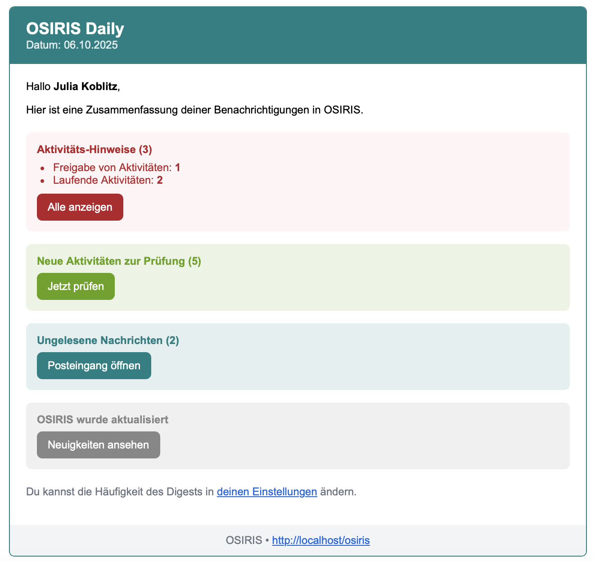

---
tags:
- E-Mail
---

# E-Mail-Digest

<!-- md:version 1.6.0 -->
<!-- md:feature -->

Mit dieser neuen Funktion kannst du von OSIRIS in regelmäßigen Abständen E-Mails erhalten, die dich über ausstehende Aktivitäten, Nachrichten und mögliche Updates informiert. Diese Funktion muss zentral von der Administration eingeschaltet werden. Eine Erklärung dafür findest du [hier](http://127.0.0.1:8000/admins/email/#email-digest). 

In deinem Profil kannst du selbst bestimmen, wie oft du Mails erhältst. Dafür gehst du auf deiner Startseite auf **Bearbeite Profil** und wählst dann **Kontakt** aus.

///caption
Hier kannst du bestimmen, wie oft du Mails von OSIRIS erhältst
///

Die Mails erhalten folgende Informationen:

- Ausstehende Benachrichtigung zu abgelaufenen Quartalen (sofern relevant).
- offene Aktivitäten & Issues,
- neue Nachrichten,
- ausstehende Reviews,
- System-News & Updates (nur wenn auch andere Benachrichtigungen vorhanden sind).

///caption
Beispiel für eine Digest-Mail von OSIRIS
///
