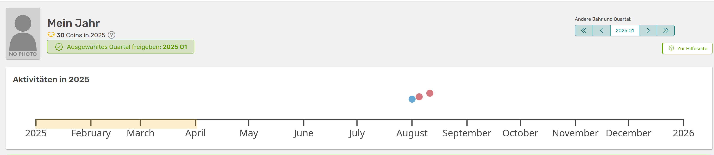
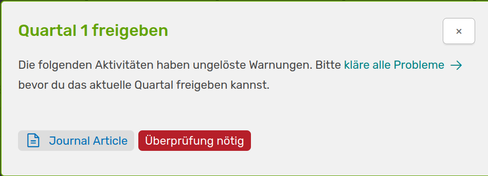
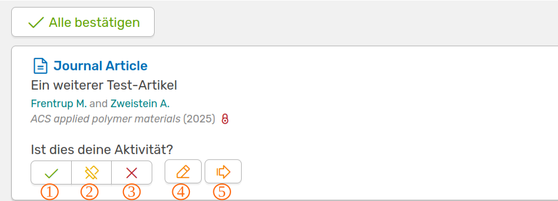
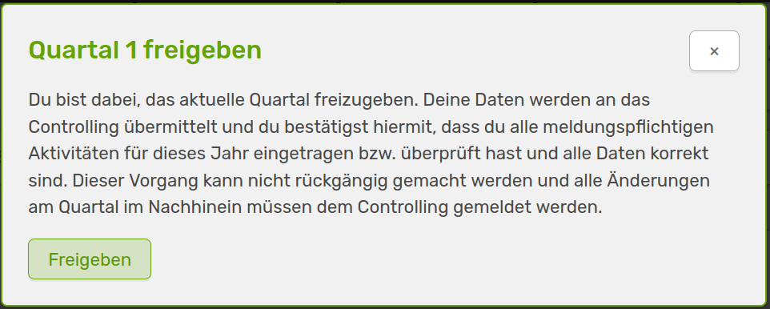
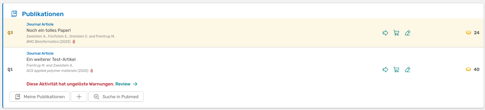
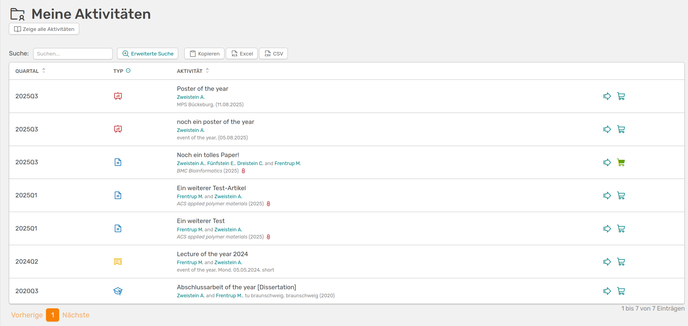

Wurde dir die Rolle eines:r Wissenschaftlers:in zugeordnet, befinden sich zwei weitere Schaltflächen links unter *Mein Bereich* - **Mein Jahr** und **Meine Aktivitäten**. Es handelt sich hier um die gleichen Seiten zu denen du durch die Direktlinks in deinem Profil weitergeleitet wirst. Sie sind in der Wissenschafter:innenansicht nur etwas präsenter, da hier deine Einträge quartalsweise verwaltet werden und von dir bestätigt werden müssen. 

## Mein Jahr

Auf der Seite "Mein Jahr" können Wissenschaftler:innen einen Überblick über alle eigenen Forschungsaktivitäten eines Jahres gewinnen und quartalsweise bestätigen, dass alle Angaben korrekt und vollständig sind. Dabei werden die Daten an die Reportenden übermittelt.

///caption
Die Seite **Mein Jahr** zeigt dir deine bisherigen Aktivitäten auf einer Zeitleiste und markiert das aktuelle Quartal
///

Oben rechts kannst du das markierte Quartal ändern. Hast du das ausgewählte Quartal noch nicht bestätigt, so wirst du durch die grün angezeigte Schaltfläche dazu aufgefordert. Wenn noch unbestätigte Aktivitäten in diesem Quartal verzeichnet wurden, wirst du aufgefordert diese zu bestätigen oder gegebenenfalls anzupassen.

--- 

///caption
Meldung zur Quartalsfreigabe mit Auflistung der fehlenden Überprüfungen und die anschließende Ansicht der zu bestätigenden Aktivitäten
///

1. Bestätigung der Aktivität
2. Die Aktivität gehört zu dir, du warst aber noch nicht mit dem Institut affiliiert
3. Ablehnung der Aktivität
4. Bearbeite die Aktivität
5. Aktivität ansehen

Wenn du alle Warnungen bearbeitet hast kannst du das Quartal bestätigen bzw. für die Berichterstattung frei geben.

///caption
Die Aufforderung an dich, das Quartal freizugeben
///

Unter der Zeitleiste findest du all deine Aktivitäten, geordnet nach Kategorien. Auch hier sind die Aktivitäten des ausgewählten Quartals markiert und du wirst darauf hingewiesen, wenn eine Aktivität noch nicht von dir bestätigt ist.

///caption
Wenn du beispielsweise das 3.Quartal ausgewählt hast, wird die erste Publikation hervorgehoben. Zudem siehst du die Warnung, dass die untere Publikation noch nicht von dir bestätigt wurde
///

Rechts kannst du dir mit dem Pfeil die Aktivität direkt anzeigen lassen, die Aktivität in den Warenkorb legen um mehrere gesammelt herunterzuladen oder die Aktivität mit einem Klick auf den Stift bearbeiten. Zudem werden dir, wenn vom Admin aktiviert, die Anzahl der Coins die du pro Aktivität gesammelt hast, angezeigt.  
Fällt dir hier auf, dass eine Aktivtät in einer Kategorie fehlt, kannst du diese einfach über das :heavy_plus_sign: hinzufügen.

## Meine Aktivitäten

Anders als auf der Seite *Mein Jahr* sind deine Aktivitäten hier nach Quartal sortiert, nicht nach Kategorie.

///caption 
Die Seite **Meine Aktivitäten** listet all deine Aktivitäten sortiert nach Quartal auf
///

Du hast hier mehrere Möglichkeiten deine Aktivitäten zu filtern oder zu durchsuchen. Zudem kannst du die Liste als Excel- oder csv-Datei exportieren. 