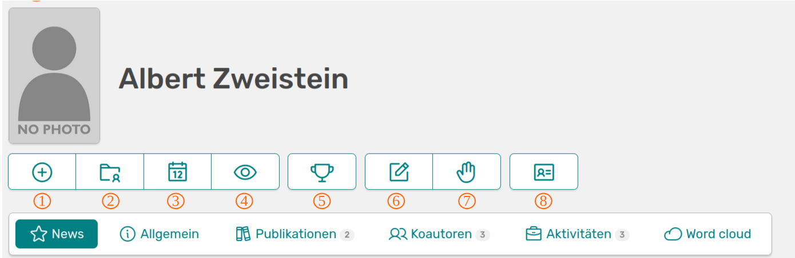
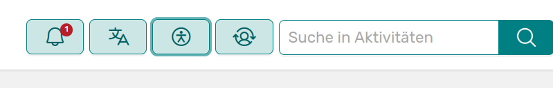
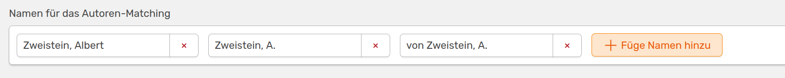

---
status: false
---    
# Deine Startseite

Auf deiner Startseite findest du alle wichtigen Informationen und Links auf einen Blick. 

///caption
OSIRIS-Startseite 
///

Im Folgenden werden die unterschiedlichen Buttons in deiner Startseite erklärt:

1. Aktivität hinzufügen: Dieser Button leitet dich sofort auf die *Füge Aktivität hinzu* Seite
2. Meine Aktivitäten: Hier siehst du die Auflistung aller Aktivitäten, die mit dir verknüpft sind
3. Mein Jahr: Du wirst auf die *Mein Jahr* Seite weitergeleitet, die dir anhand einer Zeitleiste eine Übersicht über deine Aktivitäten gibt. Das aktuelle Quartal ist gelb markiert, so wie die dazugehörigen Aktivitäten. Weitere Erklärungen findest du [hier](https://wiki.osiris-app.de/users/profile/scientist_view/)
4. Vorschau: Hier siehst du eine Vorschau deines Profils, wie es im Portfolio aussehen wird
5. Meine Errungenschaften: Falls *Errungenschaften* von der Administration aktiviert wurden kannst du deine hier sehen
6. Bearbeite Profil: Hier kannst du dein Profil bearbeiten. Näheres dazu findest du im nächsten Abschnitt
7. Aktivität beanspruchen:
8. CV exportieren: OSIRIS bietet dir hier die Möglichkeit, eine Auflistung aller Einträge zur Weiterverwendung runterzuladen

In der nächsten Leiste stehen dir weitere Direktlinks zur Verfügung. 

- News: Zeigt dir die neusten Einträge innerhalb deines Instituts in OSIRIS an
- Allgemein: Zeigt dir dein Profil mit allen von dir angegebenen Informationen an
- Publikationen: Eine Liste deiner Publikationen mit den Grafiken *Impact Factor Histogramm* und *Rolle in Publikationen*
- Koautoren: Zeigt dir dein Koautoren-Netzwerk über die letzten fünf Jahre an
- Aktivitäten: Auflistung aller Aktivitäten (außer Publikationen), dargestellt durch ein Balkendiagramm über die Jahre
- Word cloud: Eine Word cloud Abbildung basierend auf dem Titel und Abstract von Publikationen mit denen du in OSIRIS verknüpft bist

Auf deiner Startseite befinden sich oben rechts weitere Buttons.

///caption
Oben rechts findest du Buttons für allgemeine Einstellungen
///

Der Glocken-Button zeigt dir Benachrichtigungen bezüglich Updates, Namenserwähnungen etc. an. Daneben findest du die Möglichkeit die Sprache von OSIRIS auf Englisch zu stellen. Der Accessibility-Button erlaubt es dir die Seite an deine Bedürfnisse anzupassen. Wurde dir die Pflege eines anderen Profils übertragen, findest du den entsprechenden Namen mit einem Klick auf den letzten Button im Dropdown-Menü.  

## Profil bearbeiten

Hier kannst du alle Einstellungen bezüglich deines Profils vornehmen. Denke immer daran auf **Update** zu klicken, wenn du Änderungen vornimmst.

### Persönlich

Auf dieser Seite kannst du deinen Namen ändern oder auch Variationen deines Namens angeben, um das Autoren-Matching bei Publikationen zu verbessern. Hast du zum Beispiel wissenschaftliche Publikationen mit einem anderen Namen veröffentlicht, kannst du diesen hier angeben, damit die Publikationen mit deinem Profil verknüpft werden können.

///caption
Angabe von Variationen deines Namens für das Autoren-Matching
///

Änderst du deinen Namen, wird zwar die Angabe deines Namens in deinem Profil geändert und zukünftige Aktivitäten mit diesem versehen, allerdings behalten schon bestehende Einträge die alte Version bei.

### Organisation

Hier kannst du organisatorische Angaben machen, wie zum Beispiel deine Raumnummer oder deine aktuelle Position im Institut. Hat die Administration Rollen vorgegeben, kannst du hier aus einer Liste auswählen. Ist dies nicht der Fall, kannst du die Rolle per Freitext angeben.

### Forschung

Um deine Forschung zu beschreiben, kannst du aus einer Liste von Schlagwörtern wählen, die durch die Administration vorgegeben wurde. Deine Expertise und Forschungsinteressen kannst du etwas individueller über die Freitext-Felder angeben.

### Biografie

Hier kannst du deinen Werdegang abbilden, indem du deine Stationen in das vorgegebene Formular einträgst. Füge einfach einen Beitrag hinzu, wenn du mehrere Stationen angeben möchtest.

### Portfolio

Portfolio ist die Außendarstellung der institutionellen Forschung und stellt dein Profil mit allen Errungenschaften, von Publikationen über Drittmittelprojekte bis hin zu Forschungsaktivitäten dar. Auf dieser Seite kannst du selbst bestimmen, welche Informationen nach außen gezeigt werden, oder ob dein Profil überhaupt angegeben wird. Zudem kannst du eine alternative Mail-Adresse angeben.

### Kontakt

Hier kannst du deine Kontaktdaten hinterlegen, sowie deine ORCID und Google Scholar-ID angeben.

### Account

Du kannst einem anderen User die Pflege deines Profils übertragen. Dies ist zum Beispiel bei längerer Abwesenheit sinnvoll.  
:warning: Diese Person kann auf all deine privaten Angaben und Einstellungen zugreifen, sowie Änderungen vornehmen und löschen. 

### Einstellungen

Hier kannst du noch kleinere Einstellungen vornehmen, beispielsweise ob die Coins und Errungenschaften (falls aktiviert) auf deinem Profil sichtbar sind oder nicht.