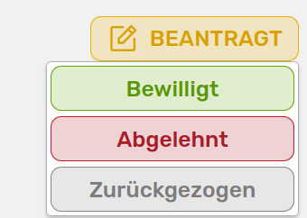
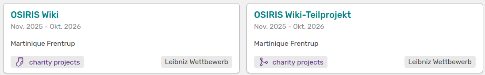

# Verwalten von Anträgen

Nachdem du einen neuen Antrag angelegt hast, gibt es drei verschiedene Möglichkeiten diesen weiter zu verwalten. Diese siehst du, wenn du oben rechts auf **Beantragt** klickst.

///caption
Es gibt drei verschiedene Möglichkeiten deinen Antrag weiter zu verwalten
///

:exclamation: Nachdem du den Status deines Antrags geändert hast, kannst du diesen nicht mehr rückgängig machen. 

## Antrag abgelehnt

Wenn dein Antrag abgelehnt wurde, kannst du dies in OSIRIS vermerken und den Status anpassen.

///caption
Diese Seite öffnet sich, wenn du **abgelehnt** auswählst
///

Hier kannst du das Datum der Ablehnung und einen Kommentar zu dem Prozess angeben. Die Übersicht deines Antrags erweitert sich um einen weiteren Tab in roter Farbe, unter dem du die Infos zur Ablehnung findest.

## Antrag zurückgezogen

Es steht dir auch zur Wahl einen zurückgezogenen Antrag in OSIRIS zu hinterlegen. Bei Auswahl von **Zurückgezogen** öffnet sich ein ähnliches Formular wie bei einer Ablehnung, bei dem du das Datum und den Grund dafür angeben kannst. 

## Antrag bewilligt

Wurde dein Antrag bewilligt, kannst du den Status entsprechend anpassen. Da sich oft bei einer Bewilligung noch ein paar Details ändern, öffnet sich bei Auswahl von **bewilligt** ein Formular, in dem du diese anpassen kannst. 

///caption
Hier kannst du unter anderem den Titel und das Startdatum deines Antrags anpassen bevor du ihn als bewilligt speicherst
///

Falls dir hier Felder fehlen kannst du deine Administration kontaktieren, da diese das Formular individuell gestalten kann.  

Nachdem du den Status angepasst hast, ändert sich auch hier die Seite deines Antrags. 

///caption
Die Seite deines Antrags, nachdem dieser bewilligt wurde
///

Du kannst den jeweiligen Status bearbeiten, in dem du entweder *Antrag* oder *Bewilligung* wählst und dann auf **aktuellen Status bearbeiten** klickst. 
Wie du siehst, ist links neben diesem Button ein weiterer dazu gekommen, mit dem du deinen Antrag in ein Projekt umwandeln kannst. Auch hier öffnet sich wieder ein Formular, welches von der Administration gestaltet werden kann. Nachdem du gespeichert hast, wird dir eine Verlinkung zum neu erstellten Projekt angezeigt.

///caption
Hier findest du den Link zum zugehörigen Projekt
///

Dein Antrag wird nun auch unter **Projekte** aufgeführt. Auf der Seite deines Projekts kannst du jetzt Aktivitäten und Kooperationspartner verlinken. Zudem findest du hier den direkten Link zu dem dazugehörigen Antrag.

///caption
Ausschnitt der Projekt-Seite
///

Auf dieser Seite werden dir alle wichtigen Details wie Laufzeit und Zeitraum zu deinem Projekt angezeigt. Diese kannst du weiterhin bearbeiten, falls sich etwas ändern sollte.  

## Teilprojekt anlegen

Auf der Projekt-Seite hast du auch die Option Teilprojekte anzulegen. Das Formular, welches sich öffnet wenn du **:heavy_plus_sign: Teilprojekt anlegen** anklickst, entspricht dem der übergeordneten Projekt-Kategorie und ist teilweise schon ausgefüllt. Felder wie Kurztitel oder Projektbeginn und -ende werden entsprechend des übergeordneten Projektes angepasst. Du kannst diese Felder aber auch ändern.  
Wenn du dein Teilprojekt gespeichert hast, wird es als weitere Kachel bei den Projekten aufgeführt.

///caption
Dein Teilprojekt markiert als Abzweigung des übergeordneten charity projects
///

Das Teilprojekt wird zukünftig auf der Projekt-Seite gelistet, sowie das übergeordnete Projekt auf der Teilprojekt-Seite gezeigt wird.