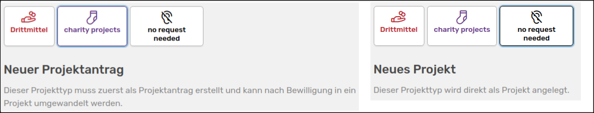
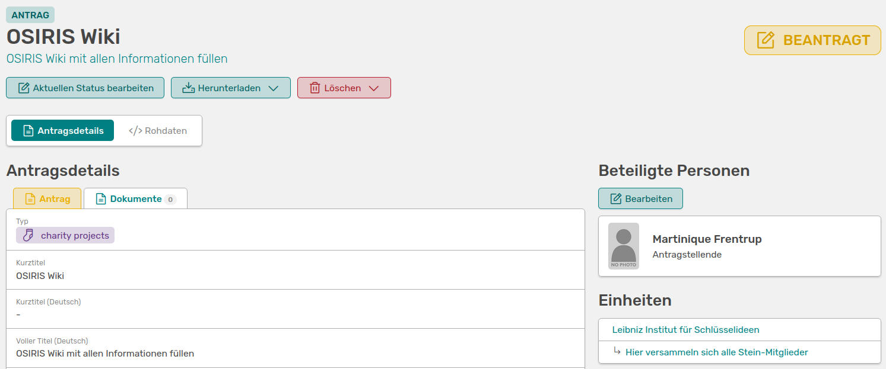

# Anlegen eines neuen Antrags oder Projekts

Wenn deiner Rolle die Rechte zum Erstellen neuer Anträge/Projekte zugeteilt wurde, kannst du sowohl über den **Anträge** als auch über den **Projekte** Button links im Menü gehen und **:heavy_plus_sign: Neuen Antrag anlegen** bzw. **:heavy_plus_sign: Neues Projekt anlegen** auswählen. Es werden dir immer alle verfügbaren Projekt-Kategorien angezeigt. Wenn du eine der Kategorien auswählst, siehst du, ob du zunächst einen Antrag erstellen musst.

///caption
Projekte, bei denen kein Antrag vorher notwendig ist werden direkt als Projekte angelegt
///

Beispielsweise muss die Projekt-Kategorie *charity projects* zunächst als Antrag angelegt werden, die Kategorie *no request needed* wird direkt als Projekt erstellt.  

Wenn du eine der Kategorien ausgewählt hast, öffnet sich ein Formular mit Pflicht- und optionalen Feldern. Nachdem du diese ausgefüllt hast, erstellst du durch Speichern deinen Antrag.

///caption
So sieht dein neuer Antrag in der ersten Phase (**Beantragt**) aus
///

Über **aktuellen Status bearbeiten** kannst du den Status, indem sich der Antrag aktuell befindet - hier also *Beantragt* - bearbeiten.  

Du kannst den Antrag auch **herunterladen** und als Word- oder JSON-Datei speichern.  

Du hast die Möglichkeit, den Antrag zu **löschen**. Sei dir hier bewusst, dass alle Verknüpfungen zu Personen, Aktivitäten oder sonstiges verloren gehen und dieser Schritt nicht mehr rückgängig gemacht werden kann. Falls dir der löschen-Button nicht angezeigt wird, hast du nicht die Rechte Anträge bzw. Projekte zu löschen.  

Falls der Antrag in seinem aktuellen Status bearbeitet wurde, wird dir dies unter dem **Historie** Tab angezeigt.

///caption
Historie mit Details zu Änderungen an dem Antrag
///

Unter dem Tab **Dokumente** kannst du deinem Antrag verschieden Unterlagen hinzufügen und somit zentral für alle Beteiligten zur Verfügung stellen.

Wie du siehst, wird dein Projekt auch automatisch [Organisationseinheiten](/users/units/) hinzugefügt. Dies richtet sich nach den Personen, die mit dem Projekt verknüpft worden sind.