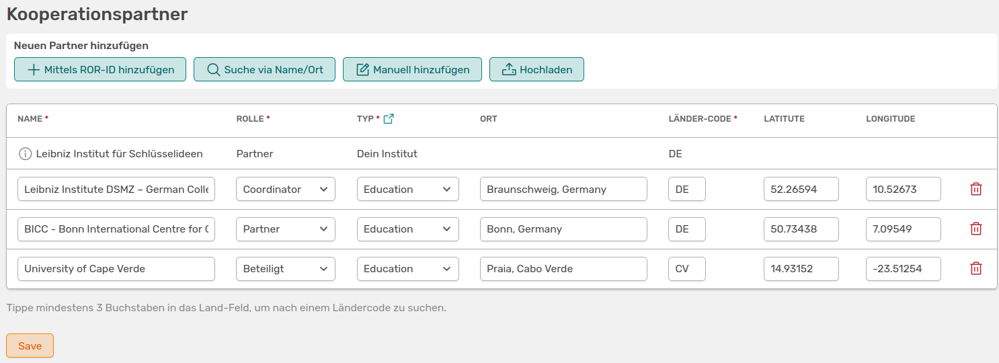
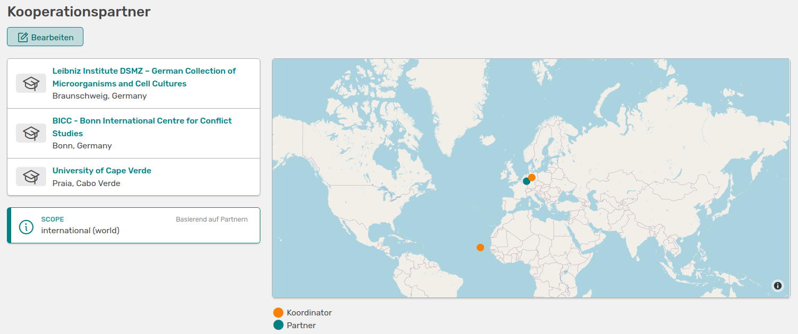

# Projekte verlinken

Wie auch in anderen Bereichen in OSIRIS, kannst du Projekte mit beteiligten Personen, Kooperationspartnern oder Aktivitäten verlinken. 

## Kooperationspartner verlinken

Wenn du deinem Projekt über den Button **:heavy_plus_sign: Kooperationspartner** hinzufügen möchtest, öffnet sich folgende Seite:

///caption
Seite um Kooperationspartner hinzuzufügen mit verschiedenen Einstellungsmöglichkeiten
///

Es gibt verschiedene Möglichkeiten Partner hinzuzufügen. Du kannst die [ROR-ID](https://ror.org/) nutzen, direkt nach dem Institut suchen oder dieses manuell hinzufügen. Bei den ersten beiden Methoden füllt OSIRIS die meisten Felder automatisch aus. Wenn du ein Institut manuell hinzufügst müssen folgende Felder ausgefüllt werden:

- **Name des Instituts**
- **Rolle:** Du hast hier die Auswahl zwischen *Partner, Coordinator* und *Beteiligt*
- **Typ:** Auch hier hast du eine Auswahl an Begriffen, die sich nach [ROR-Metadaten](https://ror.readme.io/docs/ror-data-structure#types) richtet
- **Ländercode:** Tippe die Anfangsbuchstaben des Landes ein, um den Ländercode auszuwählen

Um all deine Kooperationspartner auf einer Weltkarte darstellen zu können, kannst du hier auch die genauen Koordinaten des Partnerinstituts angeben. 

///caption
So sieht die Seite mit deinen Kooperationspartnern für dein Projekt aus
///

Die Verlinkungen der Einrichtungen werden zukünftig auf der jeweiligen Seite der [Organisation](https://wiki.osiris-app.de/users/organisations/) aufgeführt. Zudem werden Institute, die du hier manuell hinzufügst, mit in die Auflistung von Organisationen aufgenommen. 

## Aktivitäten verlinken

Du kannst deine Projekte mit eingetragenen Aktivitäten in OSIRIS verknüpfen. Wenn du auf  **:heavy_plus_sign: Aktivität verknüpfen** gehst, öffnet sich ein Widget, mit dem du nach Aktivitäten suchen und auswählen kannst.  
Die Verknüpfung kann allerdings auch über die Aktivitäten-Seite stattfinden. Wählst du eine Aktivität aus, kannst du auf der Seite den Button **:heavy_plus_sign: Projekt verknüpfen** auswählen.

///caption
Widget auf der Aktivitäts-Seite,um ein Projekt zu verknüpfen
///

Hier kannst du nach den verfügbaren Projekten in OSIRIS suchen und dieses mit der Aktivität verbinden. Wähle das Projekt aus, betätige den Button rechts daneben (Projekt hinzufügen) und bestätige deine Auswahl. 

## Personen hinzufügen

Du kannst sowohl Anträgen als auch Projekten Personen in verschiedenen Rollen hinzufügen. In beiden Fällen kannst du im Erstellungs-Formular schon weitere Personen als Antragssteller angeben. Du kannst im Nachhinein aber auch rechts bei **Projektmitarbeitende** die Personen bearbeiten.

///caption
Hier kannst du deinem Antrag oder deinem Projekt weitere Personen hinzufügen und diesen verschiedene Rollen zuordnen
///

Wenn du deinem Antrag mehrere Personen hinzugefügt hast und dieses nach der Bewilligung in ein Projekt umwandelst, werden diese automatisch mit dem Projekt verlinkt. Personen, die anschließend dem Projekt hinzufügst, werden allerdings nicht rückwirkend mit dem Antrag verlinkt.  
Du kannst den Personen im Projekt verschiedene Rollen aus dem Dropdown-Menü zuordnen. Sollte dir hier eine Rolle fehlen, kontaktiere eure Administration. Diese kann das [Vokabular](https://wiki.osiris-app.de/admins/content/vocabulary/) für Projektrollen anpassen.  
Zudem kannst du rechts in der Tabelle bestimmen, für welche Organisationseinheit die Personen in diesem Projekt aktiv sind. Ist eine Person in mehreren Abteilungen tätig oder zum Beispiel Führungskraft einer übergeordneten Einheit, im Projekt aber aktiv für eine Arbeitsgruppe, kannst du dies in der Tabelle entsprechend anpassen. 