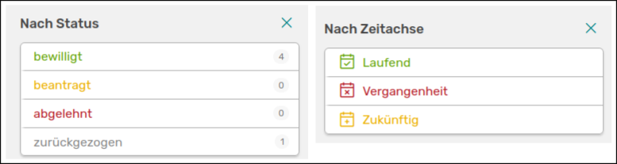

# Anträge und Projekte durchsuchen

Du kannst sowohl auf der Seite der Anträge als auch auf der Projektseite verschiedene Filter nutzen, um Einträge zu durchsuchen. Rechts an der Seite stehen dir Filteroptionen wie Projekttyp, Zuwendungsgeber, Forschungsbereiche oder Organisationseinheiten zur Verfügung. Hier gibt es allerdings auch einen spezifischen Filter für Anträge und Projekte.

///caption
Links siehst du die Filteroption für Anträge, rechts für die Projekte
///

Anträge kannst du gesondert nach dem Status filtern, Projekte wiederum nach der Zeitachse. Zudem gibt es bei Projekten einen extra Filter für Teilprojekte.  

Bei den Projekten kannst du zudem die [erweiterte Suche](/users/activities/advanced-search/) nutzen, die vom Prinzip die der erweiterten Aktivitäten-Suche gleicht.

///caption
Die Seite der erweiterten Suche für Projekte
///

Rechts kannst du deine selbst erstellten Suchen abspeichern um diese erneut nutzen zu können. Unter dem Suchfeld wird dir der MongoDB Befehl deiner Suche angezeigt, falls du diesen für andere Anwendungen, wie zum Beispiel [Berichte-Vorlagen](/users/reporting/report-templates/), in OSIRIS nutzen möchtest.