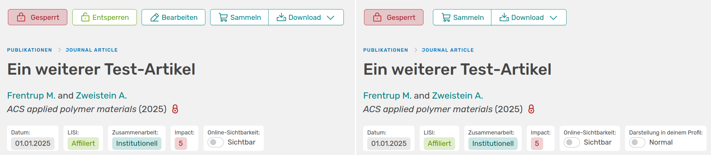
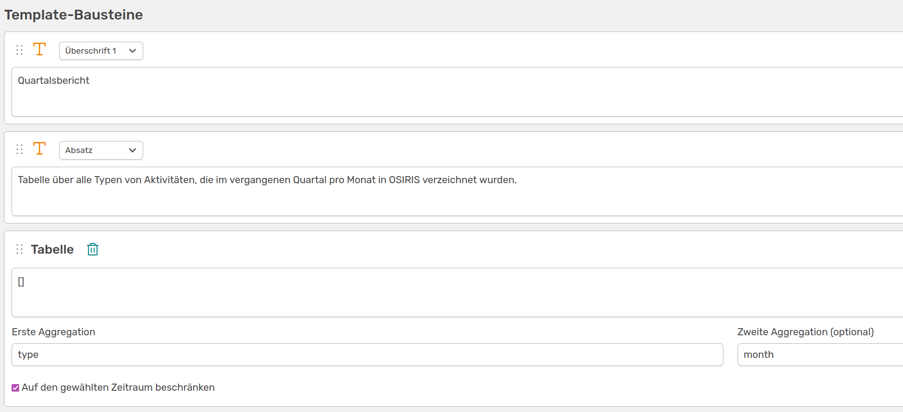
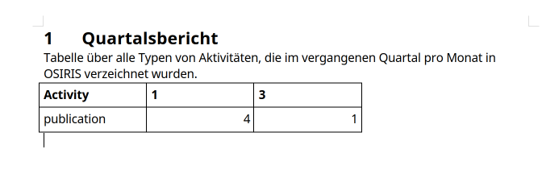

# Quarterly reporting

OSIRIS supports quarterly reporting with an extra function that the administration can activate under Settings &#8594 Functions. If this is the case, all users are reminded every 3 months to update, check and submit their activities for reporting.

## My year

On the [My year](/users/profile/scientist_view/) page, each user has an overview of their own activities, divided into categories. The linked page explains exactly what a reminder of the quarterly release looks like.  

## Confirming the quarter

At the end of each quarter, users are prompted to release the quarter with the following message:

///caption
Notification displayed to each user at the end of each quarter
///

You are then taken to the **My year** page, which shows exactly which activities still require an action. You can then release the quarter here.

## Block activities

To prevent changes to activities, they can be **locked**. This can be useful, for example, if entries have already been included in reports. Locking activities is a right that is released by the administration and is usually carried out by the admin themselves or the editor. If you have the right to do so, the *Block* option will be displayed on the *All activities* page next to the *Statistics* button.

///caption
**Lock time period**: If you click on the lock button, you will be taken to this page. Here you can set a time period and block all activities (that were report-worthy) that fall within this time. They can then no longer be deleted or edited by users
///

Activities that are not report-worthy (e.g. online ahead of print, activities without affiliated authors) are not blocked.  
Blocked activities can only be edited or deleted by the editor or admin by default. This is made clear by the different display of a blocked activity.

///caption
**Links**: Editor/admin view of a closed activity; **Right**: User view. On the left, it is still possible to unlock or edit the activity; on the right, it can only be downloaded or added to the basket
///

## Create quarterly reports

To create quarterly reports, you can create a [report template](/users/reporting/report-templates/). This could look like this, for example:

///caption
Report editor for creating a template for quarterly reports
///

The template is kept very simple and only generates an aggregated table of all activity types. You can then select the period yourself under **Reports**.

///caption
Template of the quarterly report created above
///

You can choose here whether you want to export the report in a Word document or as HTML. If you select these settings, the report will look like this in the Word document, based on the building blocks that were put together in the report editor:

///caption
The 1st quarterly report for the year 2025 with an aggregated table for the three months
///

## Deactivate quarterly reports

To deactivate the function, please contact the administration. They can deactivate quarterly reporting under Settings &#8594 Functions and the users will no longer receive any notifications.