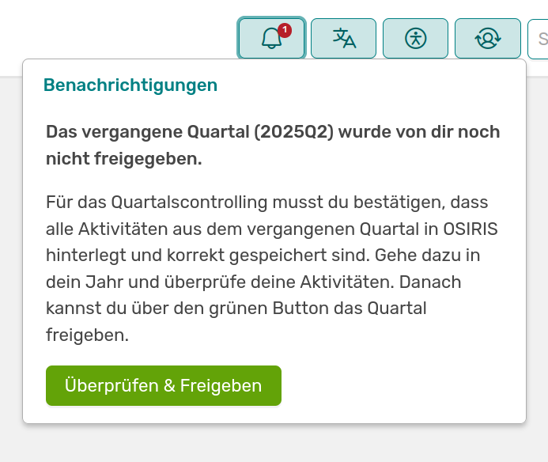
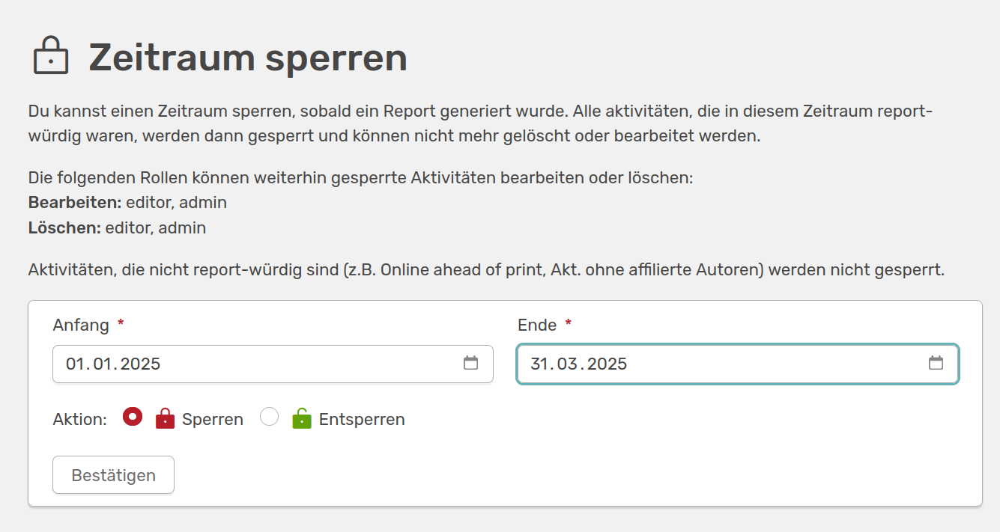
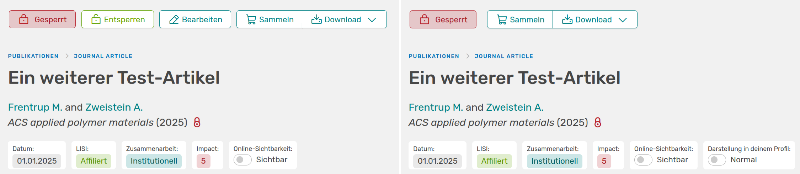
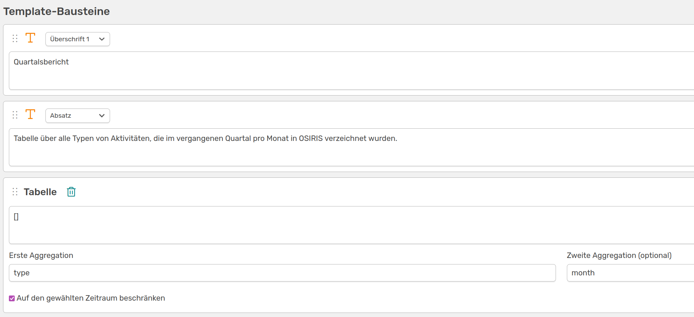
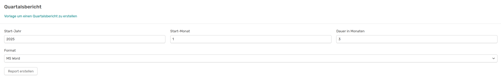
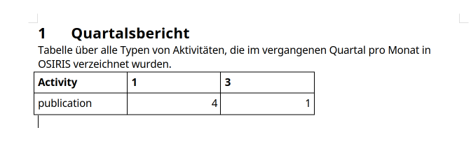

# Quartalsweise Berichterstattung

OSIRIS unterstützt die quartalsweise Berichterstattung mit einer extra Funktion, die die Administration unter Einstellungen &#8594 Funktionen aktivieren kann. Ist dies der Fall werden alle Nutzenden alle 3 Monate daran erinnert ihre Aktivitäten zu aktualisieren, zu überprüfen und für die Berichterstattung zu übermitteln. 

## Mein Jahr

Auf der Seite [Mein Jahr](https://wiki.osiris-app.de/users/profile/scientist_view/) hat jeder Nutzende eine Übersicht über die eigenen Aktivitäten, eingeteilt nach Kategorien. Auf der verlinkten Seite wird genau erklärt wie eine Erinnerung an die quartalsweise Freigabe aussieht.  

## Das Bestätigen des Quartals

Am Ende jedes Quartals werden die Nutzenden mit folgender Nachricht dazu aufgefordert, dass Quartal freizugeben:

///caption
Benachrichtigung, die Ende jedes Quartals bei jedem Nutzenden angezeigt wird
///

Man gelangt dann zu der Seite **Mein Jahr**, in der genau angezeigt wird welche Aktivitäten noch eine Handlung benötigen. Anschließend kann man hier das Quartal freigeben.

## Aktivitäten sperren

Um Änderungen an Aktivitäten zu verhindern, können diese **gesperrt** werden. Das kann beispielsweise praktisch sein, wenn Einträge schon in Berichte mit eingeflossen sind. Das Sperren von Aktivitäten ist ein Recht, welches von der Administration freigegeben wird und meist durch den Admin selbst oder den Editor vorgenommen wird. Hast du das Recht dazu, wird dir die Option *Sperren* auf der *Alle Aktivitäten* Seite neben dem *Statistik*-Button angezeigt.

///caption
**Zeitraum sperren**: Wenn du auf den Sperren-Button klickst, gelangst du zu dieser Seite. Hier kannst du einen Zeitraum festlegen und damit alle Aktivitäten sperren (die Berichts-würdig waren), die in diese Zeit fallen. Sie können dann nicht mehr durch Nutzende gelöscht oder bearbeitet werden 
///

Aktivitäten, die nicht reportwürdig sind (z.B. Online ahead of print, Aktivitäten ohne affiliierten Autoren) werden nicht gesperrt.  
Gesperrte Aktivitäten können nur noch standardmäßig vom Editor oder vom Admin bearbeitet oder gelöscht werden. Das wird durch die unterschiedliche Anzeige einer gesperrten Aktivität deutlich.

///caption
**Links**: Editor/Admin-Ansicht einer gesperrten Aktivität; **Rechts**: Nutzenden-Ansicht. Links ist ein Entsperren oder Bearbeiten der Aktivität noch möglich, rechts kann diese nur noch heruntergeladen oder in den Warenkorb gelegt werden
///

## Quartalsweise Berichte erstellen

Um quartalsweise Berichte zu erstellen, kannst du dir eine [Berichte-Vorlage](https://wiki.osiris-app.de/users/reporting/report-templates/) bauen. Diese könnte beispielsweise so aussehen:

///caption
Berichtseditor zum Erstellen einer Vorlage für quartalsweise Berichte
///

Die Vorlage ist ganz simpel gehalten und generiert nur eine aggregierte Tabelle aller Typen von Aktivitäten. Den Zeitraum kannst du dann unter **Berichte** selbst wählen.

///caption
Template des oben erstellten Quartalsberichts
///

Du kannst hier wählen, ob du den Bericht in einem Word-Dokument oder als HTML exportieren möchtest. Wenn du die Einstellungen so wählst, sieht der Report, basierend auf den Bausteinen die im Berichtseditor zusammengefügt wurden, im Word-Dokument so aus:

///caption
Der 1. Quartalsbericht für das Jahr 2025 mit einer aggregierten Tabelle über die drei Monate
///

## Quartalsweise Berichte deaktivieren

Um die Funktion zu deaktivieren, kontaktiere bitte die Administration. Diese kann unter Einstellungen &#8594 Funktionen die quartalsweise Berichterstattung deaktivieren und die Nutzenden erhalten keine Benachrichtigungen mehr.