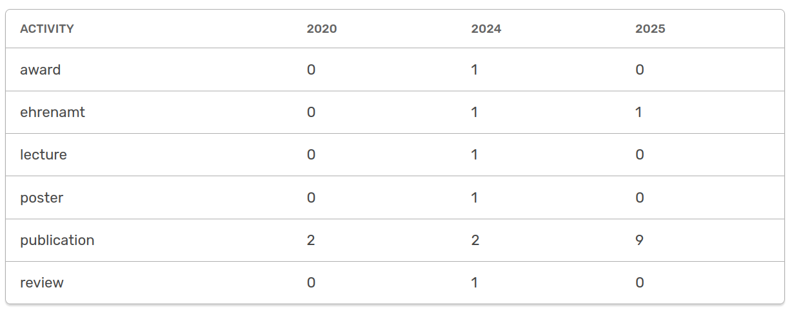
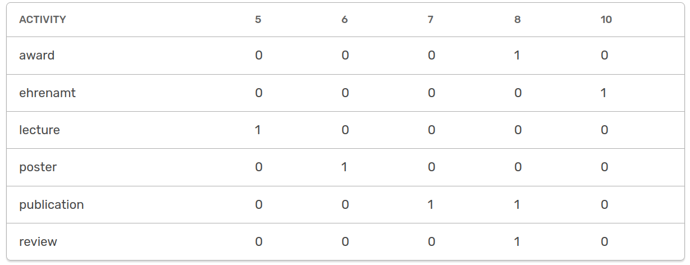
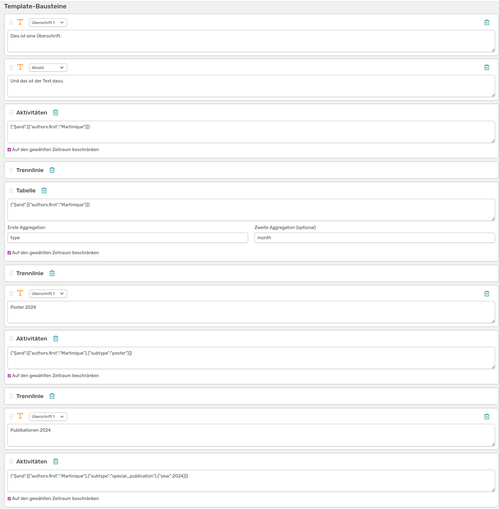

# Report templates

The report templates function allows you to create customised reports to suit the needs of your institute. To do this, select the **Report templates** button in the admin area, give your template a name and click **Create**. You are now in the **Report editor**, which allows you to create your report using various building blocks. You can give your report a description here and specify the starting month and the duration in months. This can be adjusted later by the person creating the report. All changes must be **saved** so that they are applied to the finished preview (top right).


///caption
The report editor with your chosen title and space for a description
///

## Adding modules

Each element in your report is an individual building block, which means that a building block must be added for each heading, intermediate text and list of activities. There are different types of building blocks that can be selected by clicking on **Add new building block**.


///caption
The various blocks available to you in the report editor
///

Once created, the individual blocks can be moved in order using the dots on the left using drag & drop. You can always see what your report will look like by clicking on the **Preview** button at the top right. Simply go back in the browser to return to the editor.

### Variables

<!-- md:version 1.6.0 -->

You can use the **Variables** button to add a field to your report template that can be filled in when generating the report. This makes the creation of reports more flexible. You can also use this variable in your text modules.


///caption
You can use this widget to add individual data fields to your report template, which can be customised when creating the report
///

To add a variable field to the report template, the following fields must be filled in:

- **Key:** A unique identifier for the new data field (without spaces)
- **Type:** The type of your field. You can choose between *string, integer, float and boolean*.
- Name:** A unique name for your field. This is how your field is labelled in the template
- Default value:** The value that is in the field by default

To include one of the variable fields in a text field, you can copy the necessary code directly under the default value.

### Text modules

You need text blocks to create headings and text elements in your report. You must create an individual block for each heading and text section, as the font for the entire text is defined in the field. For example, you create a text module with the font *Heading 1* and one with *Paragraph*.


///caption
Create two text blocks to add different types of text to your report. Here you can also insert the code for your variable field to customise this part of the text
///


///caption
This is what your report currently looks like
///

If you now enter a different number in the **Year** field, for example, this will also change in the text below.

### Activity modules

To list all activities that were added to OSIRIS in the period selected above in the report, add an activity module. Here you can filter the posts to be listed using the IDs of the activities by entering the following MongoDB command in the field:

```bash
{"$and":[{"type":"publication"}]}
```

This command would list all activities with the ID *publication*, for example.  
If you also want to list all posters, create a new activity module and enter the following command:

```bash
{"$and":[{"type":"poster"}]}
```

If you want to use more complex filter options, it is best to use the [advanced search](/users/activities/advanced-search/). Here you can apply various filters and copy over the corresponding MongoDB command by clicking on **Show filter**. As an example, we will filter for the first name *Martinique*.

```bash
{"$and":[{"authors.first":"Martinique"}]}
```

### Activities (with additional field)

<!-- md:version 1.6.0 -->

In addition to the listed activities, you can also use this module to add a list of activities with an **additional field**.


///caption
You can use this field to add a list of activities with an extra field. You can also sort the list according to a specific criterion
///


///caption
This is what the sorted list of activities looks like sorted by **title** in ascending order with the extra **month** field
///

You can also use **Sort** to sort your entries by a specific criterion in ascending or descending order.


### Table modules

You can add a table to your report that aggregates values according to certain criteria. You can also filter the activities here, using the same example as for the activities.  
Let's assume we want to have a table that lists the number of different activities over the last few years. To do this, we select *type* as the **first aggregation** (y-axis) and *year* as the **second aggregation** (x-axis).


---



///caption
The settings for a table module aggregated by "type" over years and the result
///

You can also choose here to limit the data to the period selected above. For example, an aggregation over the months is suitable here.


---



///caption
The settings for a table module aggregated by "type" over months for the selected period and the result
///

### Line modules

To separate the different entries more clearly in your report, you can add a dividing line with the line block.


///caption
Here you can see the arrangement of different blocks for your report
///


///caption
This is what your report looks like with the many building blocks
///

If you save the template like this, any user who is authorised to do so can create a report of this type in future. Under Export&Import &#8594 Reports, your template will look like this:


///caption
The created report template for the users with the variable fields looks like this
///

The start year, month and the duration in months that the report should cover can be set here. The variable fields can also be customised here. The finished report, which should resemble your preview in the editor, can be exported either as an MS Word document or as HTML.

