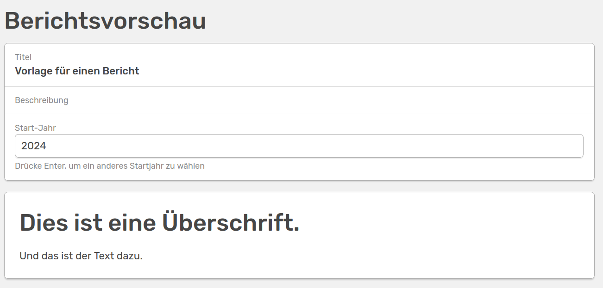

# Berichte-Vorlagen

Die Funktion der Berichte-Vorlagen ermöglicht es dir, individuelle Berichte passend für die Bedürfnisse deines Instituts zu erstellen. Wähle hierfür im Admin-Bereich den **Berichte-Vorlagen** Button, gebe deiner Vorlage einen Namen und klicke auf **erstellen**. Du befindest dich jetzt im **Berichtseditor** der es dir ermöglicht, deinen Bericht durch verschiedene Bausteine aufzubauen. Du kannst deinem Bericht hier noch eine Beschreibung geben und den Startmonat und die Dauer in Monaten festlegen. Dies kann später durch die Person, die den Bericht erstellt, angepasst werden. Alle Änderungen müssen **gespeichert** werden, damit sie für die fertige Vorschau (oben rechts) übernommen werden.


///caption
Der Berichtseditor mit deinem gewählten Titel und Platz für eine Beschreibung
///

## Hinzufügen von Bausteinen

Jedes Element in deinem Bericht ist ein individueller Baustein, das heißt, für jede Überschrift, jeden Zwischentext und jede Auflistung von Aktivitäten muss ein Baustein hinzugefügt werden. Es gibt verschiedene Arten von Bausteinen, die durch einen Klick auf **Neuen Baustein hinzufügen** ausgewählt werden können.


///caption
Die verschiedenen Bausteine, die dir im Berichtseditor zur Verfügung stehen
///

Die einzelnen Bausteine können nach dem Erstellen in der Reihenfolge über die Punkte links per Drag&Drop verschoben werden. Du kannst dir mit einem Klick auf den Button **Vorschau** oben rechts immer ansehen, wie dein Bericht aussehen würde. Gehe im Browser einfach zurück, um wieder zum Editor zu gelangen. 

### Variablen

<!-- md:version 1.6.0 -->

Über den Button **Variablen** kannst du deiner Berichts-Vorlage ein Feld hinzufügen, welches beim Generieren des Berichts ausgefüllt werden kann. So kann das Erstellen von Berichten flexibler gestaltet werden. Zudem kannst du diese Variable auch in deinen Textbausteinen verwenden.


///caption
Über dieses Widget kannst du deinem Berichts-Template individuelle Datenfelder hinzufügen, die beim Erstellen des Berichts angepasst werden können
///

Um dem Berichts-Template ein varibales Feld hinzuzufügen, müssen folgende Felder ausgefüllt werden:

- **Key:** Einen einzigartigen Identifier für das neue Datenfeld (ohne Leerzeichen)
- **Typ:** Die Art deines Feldes. Zur Auswahl stehen *string, integer, float und boolean*
- **Bezeichnung:** Eine eindeutige Bezeichnung deines Feldes. So wird dein Feld im Template bezeichnet
- **Standardwert:** Der Wert, der default im Feld steht

Um eines der variablen Felder mit in ein Textfeld einzubauen, kannst du den notwendigen Code dafür direkt unter dem Standardwert kopieren.

### Text-Bausteine

Text-Bausteine benötigst du um Überschriften und Textelemente in deinem Bericht zu erstellen. Für jede Überschrift und Textabschnitt musst du einen individuellen Baustein erstellen, da die Schrift für den gesamten Text im Feld festgelegt ist. Du erstellst also beispielsweise einen Text-Baustein mit der Schrift *Überschrift 1* und einen mit *Absatz*.


///caption
Erstelle zwei Text-Bausteine um deinem Bericht unterschiedliche Arten von Text hinzuzufügen. Hier kannst du auch den Code für dein variables Feld einfügen, um diesen Teil des Textes individuell anpassen zu können
///


///caption
So sieht dein Bericht aktuell aus
///

Wenn du jetzt zum Beispiel im Feld **Jahr** eine andere Zahl eingibst, ändert sich diese auch im unten stehenden Text.

### Aktivitäten-Bausteine

Um alle Aktivitäten, die im oben gewählten Zeitraum in OSIRIS hinzugefügt wurden, im Bericht aufzulisten, fügst du einen Aktivitäten-Baustein hinzu. Hier kannst du mithilfe der IDs der Aktivitäten die aufzulistenden Beiträge filtern, indem du folgenden MongoDB Befehl in das Feld eingibst:

```bash
{"$and":[{"type":"publication"}]}
```

Durch diesen Befehl würdest du zum Beispiel alle Aktivitäten, die mit der ID *publication* versehen sind, auflisten.  
Möchtest du zudem alle Poster auflisten, erstellst du einen neuen Aktivitäts-Baustein und gibst folgenden Befehl ein:

```bash
{"$and":[{"type":"poster"}]}
```

Wenn du komplexere Filteroptionen nutzen möchtest, nimmst du am besten die [erweiterte Suche](/users/activities/advanced-search/) zur Hilfe. Hier kannst du verschiedene Filter anwenden und dir den entsprechenden MongoDB Befehl mit einem Klick auf **Zeige Filter** rüber kopieren. Als Beispiel werden wir hier nach dem Vornamen *Martinique* filtern.

```bash
{"$and":[{"authors.first":"Martinique"}]}
```

### Aktivitäten (mit weiterem Feld)

<!-- md:version 1.6.0 -->

Neben den aufgelisteten Aktivitäten kannst du über diesen Baustein auch eine Auflistung der Aktivitäten mit einem **weiteren Feld** hinzufügen. 


///caption
Über dieses Feld kannst du eine Auflistung von Aktivitäten mit einem extra Feld hinzufügen. Zudem kannst du die Auflistung nach einem bestimmten Kriterium sortieren
///


///caption
So sieht die sortierte Auflistung der Aktivitäten nach **Titel** aufsteigend mit dem extra Feld **Monat** aus
///

Zudem kannst du deine Einträge auch über **Sortierung** nach einem bestimmten Kriterium entweder auf- oder absteigend sortieren lassen. 


### Tabellen-Bausteine

Du kannst eine Tabelle in deinen Bericht einfügen, die Werte über bestimmte Kriterien aggregiert. Auch hier kannst du die Aktivitäten filtern, als Beispiel nehmen wir den gleichen wie bei den Aktivitäten.  
Nehmen wir an, wir möchten eine Tabelle haben, die die Anzahl der unterschiedlichen Aktivitäten über die letzten Jahre auflistet. Dafür wählen wir als **Erste Aggregation** (y-Achse) *type* und als **Zweite Aggregation** (x-Achse) *year*.


---


///caption
Die Einstellungen für einen Tabellen-Baustein aggregiert nach "type" über Jahre und das Ergebnis
///

Man kann hier auch auswählen, dass die Angaben auf den oben gewählten Zeitraum beschränkt werden. Hier bietet sich beispielsweise eine Aggregation über die Monate an.


---


///caption
Die Einstellungen für einen Tabellen-Baustein aggregiert nach "type" über Monate für den gewählten Zeitraum und das Ergebnis
///

### Linie-Bausteine

Um die unterschiedlichen Einträge deutlicher in deinem Bericht voneinander zu trennen, kannst du mit dem Linien-Bausteine eine Trennlinie hinzufügen.


///caption
Hier siehst du die Anordnung unterschiedlicher Bausteine für deinen Bericht
///


///caption
So sieht dein Bericht mit den vielen Bausteinen aus
///

Wenn du die Vorlage so speicherst, kann in Zukunft jeder Nutzende, der dazu berechtigt ist, einen Bericht dieser Art erstellen. Unter Export&Import &#8594 Berichte sieht deine Vorlage  so aus:


///caption
So sieht das erstellte Berichte-Template für die Nutzenden mit den variablen Feldern aus
///

Hier können Start-Jahr, -Monat und die Dauer in Monaten, die der Bericht umfassen soll, eingestellt werden. Zudem können hier die variablen Felder entsprechend angepasst werden. Der fertige Bericht, der deiner Vorschau im Editor ähneln sollte, kann entweder als MS Word Dokument oder als HTML exportiert werden.

