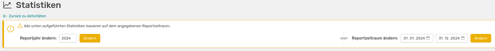
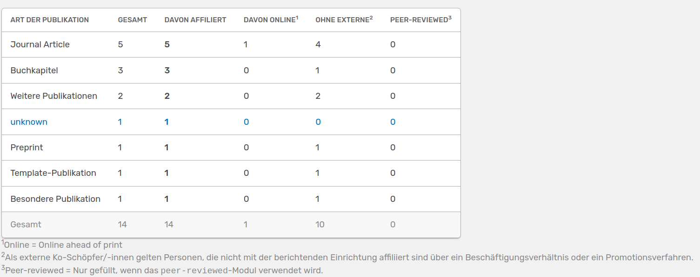

# Statistiken 

Wenn du auf der **Alle Aktivitäten** Seite bist, gelangst du über einen Button zu den **Statistiken**. Hier bietet dir OSIRIS unterschiedliche Tabellen an, die die Aktivitäten für den gewählten Report-Zeitraum zusammenfassen.

///caption
Die Statistik-Seite mit der Möglichkeit den Report-Zeitraum zu konfigurieren
///

Folgende Statistiken findest du auf dieser Seite:

- Aktivitäten im Report-Zeitraum: Hier werden die Anzahl der Aktivitäten pro Kategorien und Typen aufgezählt. Die Einträge müssen mindestens einen affilierten Autor haben, um mit in diese Statistik zu fließen
- Aktivitäten, die vor dem Zeitraum gestartet sind: Hier findest du eine Tabelle mit Einträgen, die vor dem Report-Zeitraum gestartet, aber in dem Zeitraum geendet sind. Dies trifft zum Beispiel auf Lehrveranstaltungen oder Gäste zu

- Statistiken zu Publikationen: Du kannst auf dieser Seite auch eine detailliertere Auflistung für Publikationen erhalten, in der die Einträge nach den unterschiedlichen Typen gezählt werden. 

    
    ///caption
    Detaillierte Statistik zu Publikationen in OSIRIS 
    ///
    Du kannst der Tabelle beispielsweise entnehmen, wie viele *Journal Articles* ohne externe Personen erstellt wurden und ob diese online (online ahead of print) sind. 

- Anzahl der Open Access-Publikationen: Hier werden die Aktivitäten im Report-Zeitraum nach verschiedenen Open Access Möglichkeiten aufgezählt

