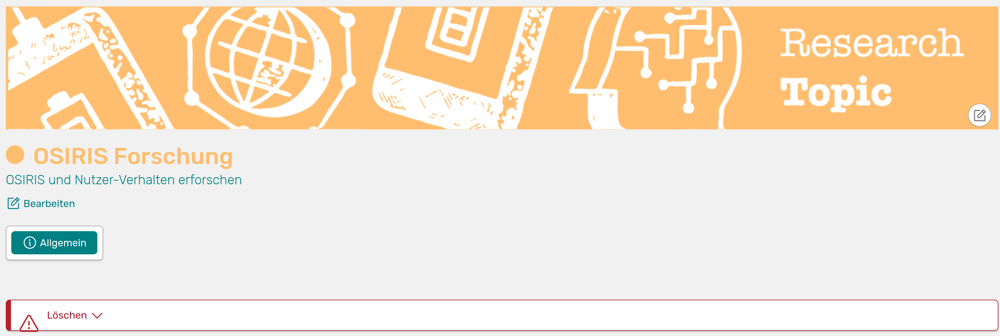

# Research areas

Research areas can be used in OSIRIS to define the thematic focus of scientific research by researchers or research groups. The function must be activated by your administration under Settings &#8594 Functions.

!!! info "Note"
    We use the term "research areas" here, but the administrator can customise this term in the settings. Therefore, you may see a different name in the OSIRIS interface instead. If you are unsure, look for an icon that looks like a puzzle piece.

By default, only the administrator has the right to create a new research area. If your role has been granted the right, you will find a button on the research area page with the option **Add new area**.

## Create new research area

When you create a new research area, it is immediately assigned a unique ID. You must also give your research area a name. The form also gives you the option of assigning a colour to the research area, adding a subtitle and a description.

///caption
Form to create a new research area
///

If you click on *save*, you will be taken to the page of your newly created research area. Here you can customise it by uploading your own image and editing the name and description.

///caption
Your newly created research area page
///

You will find the option to delete the research area under the *General* tab. This will cause all links to be lost.

## Create shortcuts

The research areas you have created will now appear in different areas in OSIRIS in order to link them to people, activities or organisational units.

///caption
This is what your research areas for linking look like. You can create a link to the respective page by clicking on it
///

To link a **person** to a research area, go to the profile &#8594 Edit profile &#8594 Research. Here you can click on the areas that you want to link to this person. After you have saved, the selected areas will be displayed on the profile with a button that leads directly to the research area.

///caption
This is how the linked research area is displayed in the profile
///

When you add a new activity in OSIRIS, the research areas are displayed below for you to choose from. You can also link activities to the areas afterwards. The filter options for [All activities](/users/activities/) have been expanded to include the research areas.

You can also link **Events**, **Organisational units** and **Infrastructures** to research areas on the respective pages and filter them accordingly.

///caption
This is what the links to research units look like on the organisational units page. The coloured dots also show you the respective links for the persons
///

All links can also be found on the respective research area page. If you have linked more than two activities, an author graph and a word cloud will be created automatically.
