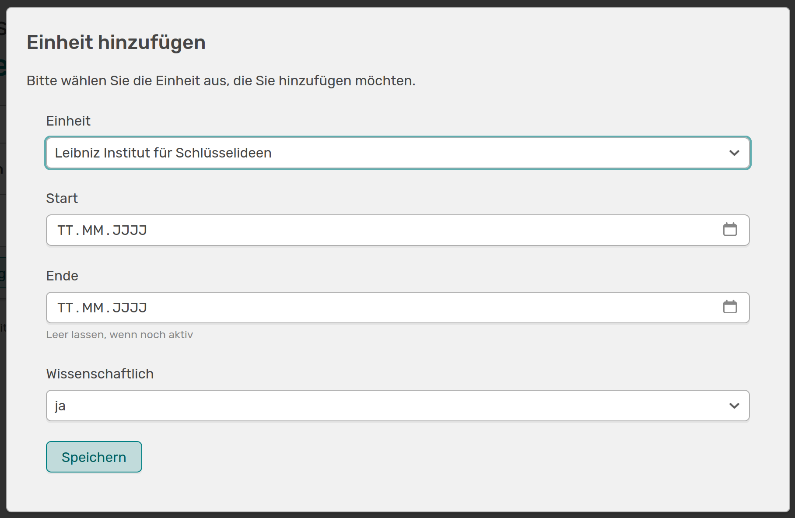

# Zeitaufgelöste Verknüpfungen

In jeder Einrichtung kommt es vor, dass Mitarbeitende die Abteilung wechseln oder vielleicht auch in mehr als einer Einheit tätig sind. Um dies zu erfassen, bietet OSIRIS jedem Mitarbeitenden die Möglichkeit, den Zeitraum den sie für die verschiedenen Einheiten tätig sind, individuell einzustellen. 

///caption
Auf deiner Startseite siehst du oben rechts deine verknüpften Organisationseinheiten. Mit einem Klick auf den Stift kommst du zur Bearbeitungs-Seite
///

///caption
Hier kannst du individuelle Einstellungen bezüglich deiner Organisationseinheiten vornehmen
///

Auf dieser Seite werden all die Organisationseinheiten aufgelistet, denen du zugeordnet wurdest. Falls dir hier eine Organisationseinheit fehlt, kannst du weitere über **Einheit hinzufügen** ergänzen.

///caption
Hier kannst du aus einem Dropdown Menü deinem Profil eine Organisationseinheit hinzufügen und direkt den Zeitraum, den du für diese tätig bist bzw. warst, angeben
///

Befindet sich die hinzuzufügende Einheit nicht in der Liste, kannst du selbst eine neue Organisationseinheit [erstellen](https://wiki.osiris-app.de/users/units/edit_units/), falls du die Rechte dafür hast. Ist dies nicht der Fall, kontaktiere bitte eure Administration.

Du kannst hier angeben, ob du in der Einheit wissenschaftlich tätig bist oder nicht. Wenn du eine Einheit als **wissenschaftlich** auf deinem Profil markierst, werden alle dir zugehörigen Forschungsaktivitäten mit dieser Einheit verknüpft. Diese werden dann auf der Organisationseinheiten-Seite unter dem Tab **Aktivitäten** aufgelistet und die Organisationseinheit wird unten rechts in der erweiterten Ansicht der Aktivität angezeigt.  
Dies gilt allerdings nur für Aktivitäten, die in den Zeitraum fallen, den du hier für die Einheit angibst.  
Stellst du *wissenschaftlich* auf *nein*, werden deine Aktivitäten nicht mit der Einheit verknüpft.

///caption
Hier kannst du den genauen Zeitraum angeben, den du für die Organisationseinheit tätig bist bzw. warst
///

In diesem Beispiel werden nur die Aktivitäten dieser Einheit hinzugefügt, die nach dem 28.08.2025 stattgefunden haben. Aktivitäten mit einem Datum vor deinem Eintritt in diese Einheit werden nicht verknüpft.

