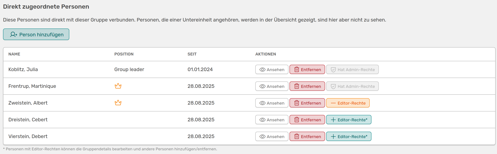

# Bearbeiten von Einheiten

Wenn du das Recht dazu hast eine Organisationseinheit zu bearbeiten, kannst du über den Button **bearbeiten** verschiedene Einstellungen vornehmen. 

## Allgemein

Unter dem Tag **Allgemein** kannst du der Einheit eine Beschreibung hinzufügen. In der Text-Box stehen dir die gängigen Formatierungsoptionen zur Verfügung.

///caption
Allgemeine Einstellungen, die du für die Einheit vornehmen kannst
///

Zudem kannst du hier bestimmen, ob die Einheit öffentlich angezeigt wird und sie als inaktiv markieren, falls diese Einheit nicht mehr aktiv am Institut ist. Die Pflichtfelder wie Name und Abkürzung können hier auch noch geändert werden, genauso wie die Farbe. Du kannst dieser Einheit eine **Kostenstelle** hinzufügen und mit verfügbaren [Forschungsbereichen](https://wiki.osiris-app.de/users/topics/) verknüpfen.

## Personal

Unter Personal kannst du die leitenden Personen anpassen und der Organisationseinheit weitere Mitarbeitende hinzufügen. 

///caption
Hier kannst du weitere leitende Personen hinzufügen und die Reihenfolge anpassen
///

Wenn du der Organisationseinheit weitere Personen zuordnen möchtest, kannst du dies über den Button **Person hinzufügen** machen. Hier kannst du aus einem Dropdown-Menü den Namen auswählen, das Startdatum der Zugehörigkeit angeben und bestimmen, ob die Person wissenschaftlich affiliert ist oder nicht.  
Alle hinzugefügten Personen werden unter **Direkt zugeordnete Personen** aufgelistet. 

///caption
Liste der zugeordneten Personen mit weiteren Einstellungsmöglichkeiten und der Anzeige von Admin-Rechten
///

In der Liste kannst du sehen, welche Position die Person hat und seit wann sie der Einheit zugehörig ist. Dieses [Datum](https://wiki.osiris-app.de/users/units/connections) kann nur von der Person selbst angepasst werden.  
Bei Aktionen kommst du über den **Ansehen** Button direkt auf das Profil der Person. Du kannst die Person hier auch aus der Liste löschen und ihr Editoren-Rechte an dieser Organisationseinheit geben. Falls die Person Administratoren-Rechte, und somit sowieso die Editoren-Rechte an Organisationseinheiten hat, wird dir das statt des Editor-Buttons angezeigt.

## Forschung

Unter diesem Tab kannst du der Einheit Forschungsinteressen hinzufügen. Nachdem du einen Begriff hinzugefügt und gespeichert hast, kannst du weitere Details angeben und Aktivitäten verknüpfen.

///caption
Hinzufügen von Forschungsinteressen und Verknüpfung mit Aktivitäten
///

Du kannst deinen Forschungsinteressen einen Untertitel und eine ausführliche Beschreibung hinzufügen, wobei dir hier alle gängigen Formatierungsoptionen zur Verfügung stehen. In dem Suchfeld kannst du nach einer Aktivität suchen, die du mit diesem Interesse verknüpfen möchtest. Dies ist hier, im Gegensatz zur Verknüpfung mit der Einheit an sich, zeitunabhängig möglich - du kannst einfach einen Begriff eingeben, auf **suchen** drücken und es werden dir alle gefundenen Aktivitäten aufgelistet, die du dann mit einem Klick hinzufügen kannst. Diese Verknüpfung wird nicht in der erweiterten Aktivitätenansicht angezeigt und dient eher zur Organisation der Literatur.

## Löschen

Jede Person, die die Editor-Rechte für die Einheit hat, kann diese auch löschen. Hier sei darauf verwiesen, dass das Entfernen der Einheit nicht rückgängig gemacht werden kann und es zu bevorzugen ist die Einheit unter **Allgemein** zu inaktivieren.