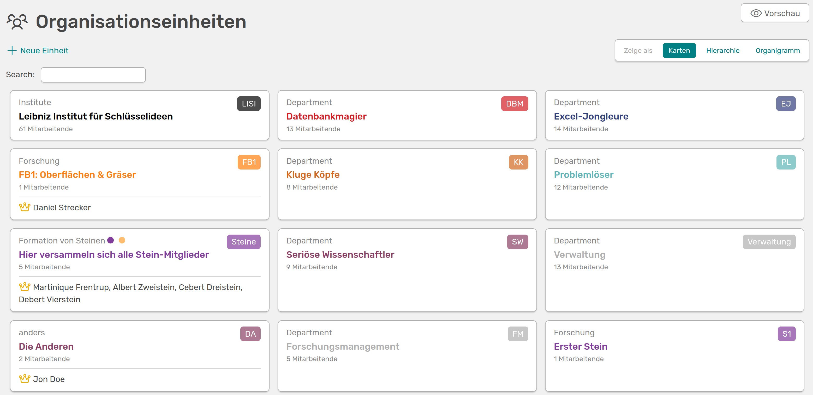

# Organisationseinheiten 

Organisationseinheiten können dabei helfen das Organigramm eurer Einrichtung in OSIRIS abzubilden und Mitarbeitende direkt mit Abteilungen zu verknüpfen. Ihr findet die Organisationseinheiten links im Menü unter **Personen &#8594 Einheiten**. 

///caption
Organisationseinheiten in OSIRIS, dargestellt als Karten
///

Auf der dieser Seite siehst du alle angelegten Einheiten und Untereinheiten, die Art der Gruppe, die Anzahl der Mitglieder und die verantwortlichen Personen. Rechts oben kannst du die Darstellung der Einheiten anpassen.

///caption
Die Hierarchie-Ansicht listet alle Einheiten und die dazugehörigen Untereinheiten auf
///

In der Hierarchie-Ansicht werden die untergeordneten Gruppen durch das entsprechende Einrücken verdeutlicht. 

///caption
Die Organigramm-Ansicht bietet dir eine interaktive Oberfläche um dir die Einheiten und Untereinheiten anzusehen
///

In der Organigramm-Ansicht kannst du dir mit einem Klick auf eine Einheit die dazugehörigen Untereinheiten anzeigen lassen. Zudem kannst du oben links wählen, ob du eine linksbündige Ansicht oder eine Anordnung von oben nach unten bevorzugst. 

