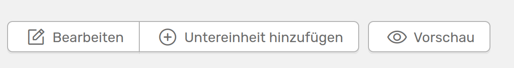

# Add a new unit

You can create a new unit using the **:heavy_plus_sign: new unit** button on the start page of the organisational units.

///caption
You can add new organisational units using this form
///

The following information is required:

- Abbreviation of the unit
- Type of group - double-click in the field to get suggestions
- Name of the unit in English and German

You can also assign an individual colour to your new unit, which is then also selected for all sub-units. This is also clear from the fact that the colour selection is not available when adding a new sub-unit. So if you select a different unit instead of your institute under **Superordinate group**, you cannot assign a colour.  
In this step, you can only add the **leading persons** to your new unit, which are listed next to the crown icon in the map view of all units. Once you have created the unit, you can add more people.

## Adding a sub-unit

Once you have created your new unit, you can add new sub-units on the unit page.

///caption
Button for adding a new subunit
///

The form for adding a subunit is similar to the one shown above, except that the colour selection is not available, as the colour of the parent group is used here. If you still want to customise the parent group, you can do this via the drop-down menu.